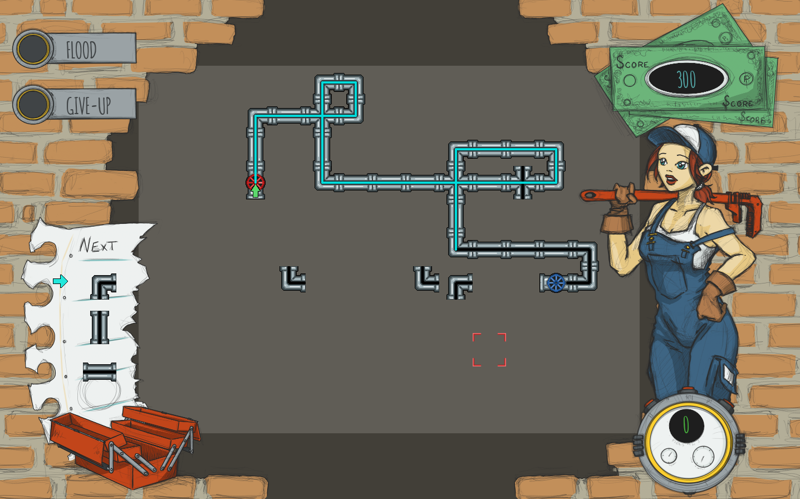

# Plumb'it

## About
Plumb'it is a puzzle game, the goal is to create a circuit connecting the start valve to the end valve before the liquid leaks.
It was inspired by the game "pipe mania" written by Assembly line and published by Empire in 1989 for the commodore AMIGA.
It's one of my firsts python project.

## Languages
It is developed in python3 and uses the Pygame library.

## Requirements
- Python >= 3.6
- Pygame 2.1.2

## Install
- Fork it, clone it...
- Create a python3 virtual environement: `python3 -m venv <your venv name>`
- Activate your venv `source <your venv name>/bin/activate`
- Install the requirements with PIP: `pip install -r requirements.txt`
- Run: `python app/plumbit.py` or `./plumbit.sh` if your on a GNU/Linux.

## Credit
- Code by Germain GAILLARD [germain@gaillard.dev](mailto:germain@gaillard.dev)
- Art and graphics by Germain GAILLARD [germain@gaillard.dev](mailto:germain@gaillard.dev)
- Sounds from [soundbible.com](https://soundbible.com/)
- Music: "Solve The Puzzle" by patrick DEARTEAGA [patrickdearteaga.com](https://patrickdearteaga.com)

## License
Plumb'it is under MIT license.

## Note
This game is still in development and optimize for a 1920x1080 screen.
Feel free to contribute...
